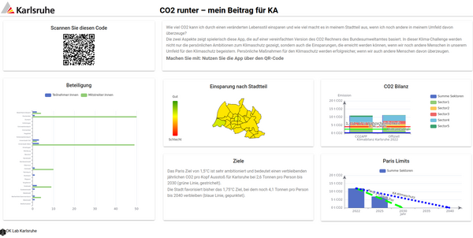

# co2dash
Quick hack dashboard for "Bunte Nacht der Digitalisierung" to display feedback and CO2 emission modelling

## Dashboard "Bunte Nacht"

Cooperates with [co2app](https://github.com/CodeforKarlsruhe/co2app) 

Version used at [Bunte Nacht, 1.7.2022](https://ok-lab-karlsruhe.de/projekte/bunte-nacht/)

With **SIMPLE** backend, see [rest.php](public/rest.php)

## Demo
See [here](https://co2dash.ok-lab-karlsruhe.de)

NB: Updates every 10s, proper display only after 1st update
